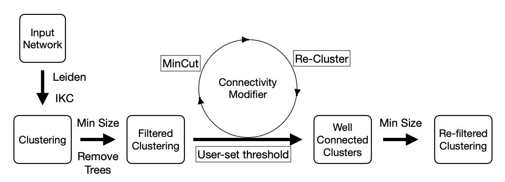

# CM++ Pipeline

- [CM++ Pipeline](#cm-pipeline)
  - [Requirements](#requirements)
  - [Setup](#setup)
    - [Setup via Cloning](#setup-via-cloning)
    - [Setup via pip install](#setup-via-pip-install)
  - [Input and Usage](#input-and-usage)
    - [JSON Input Documentation](#json-input-documentation)
  - [For Developers](#for-developers)
    - [Loading a Developer Environment](#loading-a-developer-environment)
    - [Customizing the Pipeline](#customizing-the-pipeline)
  - [Output Files](#output-files)
  - [Archive](#archive)
  - [Citations](#citations)

Customizable modular pipeline for testing and using an improved version of CM for generating well-connected clusters. Image below from Park et. al. (2023). https://github.com/illinois-or-research-analytics/cm_pipeline/tree/main



## Requirements

- `python3.9` or higher
- `cmake 3.2.0` or higher
- `openmpi` and `gcc` of any version
  - In our analysis, `openmpi 4.2.0` and `gcc 9.2.0` were used

## Setup

### Setup via Cloning

- Clone the cm_pipeline repository
- Activate the venv which has the necessary packages
- Run `pip install -r requirements.txt`
- Make sure everything installed properly by running `cd tests && pytest`

### Setup via pip install

Simply run `pip install git+https://github.com/illinois-or-research-analytics/cm_pipeline`. This will install CM++, but to use pipeline functionality, please setup via cloning.

## Input and Usage

- The input to the pipeline script is a [pipeline.json](pipeline.json) file. **NOTE** that you can use any other json file as input as long as it fits the requirements in the documentation.
- Description of the supported key-value pairs in the config file can be found here [pipeline_template.json](docs/pipeline_template.json)
- Edit the fields of the `pipeline.json` file to reflect your inputs and requirements.
- Run `python -m main pipeline.json`

### JSON Input Documentation

- Please refer to the [json format documentation](docs/json_format.md) on how to write the `pipeline.json` file.

## For Developers

### Loading a Developer Environment

To quickly set up a developer environment for the CM++ Pipeline, simply run the following commands. (**NOTE: Make sure you have Conda installed**)

```bash
conda env create -f environment.yml
conda activate 
```

### Customizing the Pipeline

- The CM++ Pipeline also allows for users to add their own pipeline stages and clustering methods.
- Please refer to the [customization documentation](docs/pipeline_customization.md) on how to modify the code to allow for your own pipeline stages and .

## Output Files

- The commands executed during the workflow are captured in `{output_dir}/{run_name}-{timestamp}/commands.sh`. This is the shell script generated by the pipeline that is run to generate outputs.
- The output files generated during the workflow are stored in the folder `{output_dir}/{run_name}-{timestamp}/`
- The descriptive analysis files can be found in the folder `{output_dir}/{run_name}-{timestamp}/analysis` with the `*.csv` file for each of the resolution values.

## Archive

- [View Old Release Notes](https://github.com/illinois-or-research-analytics/cm_pipeline/releases)

## Citations

```bibtex
@misc{cm_pipe2023,
    author = {Vikram Ramavarapu and Vidya Kamath and Minhyuk Park and Fabio Ayres and George Chacko},
    title = {Connectivity Modifier Pipeline},
    howpublished = {\url{https://github.com/illinois-or-research-analytics/cm_pipeline}},
    year={2023},
}

@misc{park2023wellconnected,
    title={Well-Connected Communities in Real-World and Synthetic Networks}, 
    author={Minhyuk Park and Yasamin Tabatabaee and Vikram Ramavarapu and Baqiao Liu and Vidya Kamath Pailodi and Rajiv Ramachandran and Dmitriy Korobskiy and Fabio Ayres and George Chacko and Tandy Warnow},
    year={2023},
    eprint={2303.02813},
    archivePrefix={arXiv},
    primaryClass={cs.SI}
}
```
